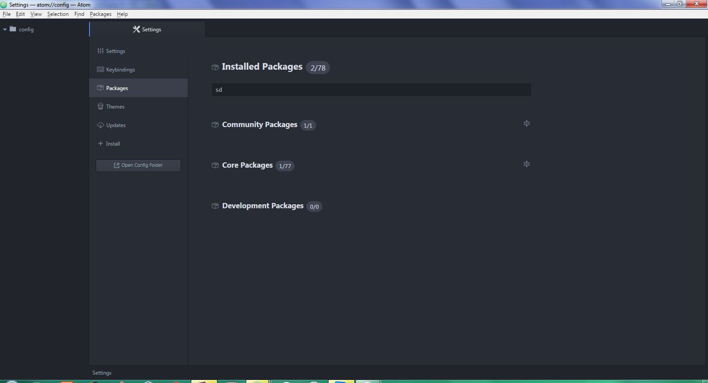

# Atom

Atom Code Editor is from GitHub Community. An open source software.

###Top 5 features of Atom

The extensions on Atom is called package and is accessed through the Package library. 
- Go to File --> Settings
- Choose the Package Tab to see all the installed packages. There are three categories
 1. Community Package
 2. Core Package
 3. Development Package
 

To install a package go to the install tab. There are two options
 1. Packages
 2. Themes
 
### Most used packages

### Theme of choice

### Shortcuts

   

