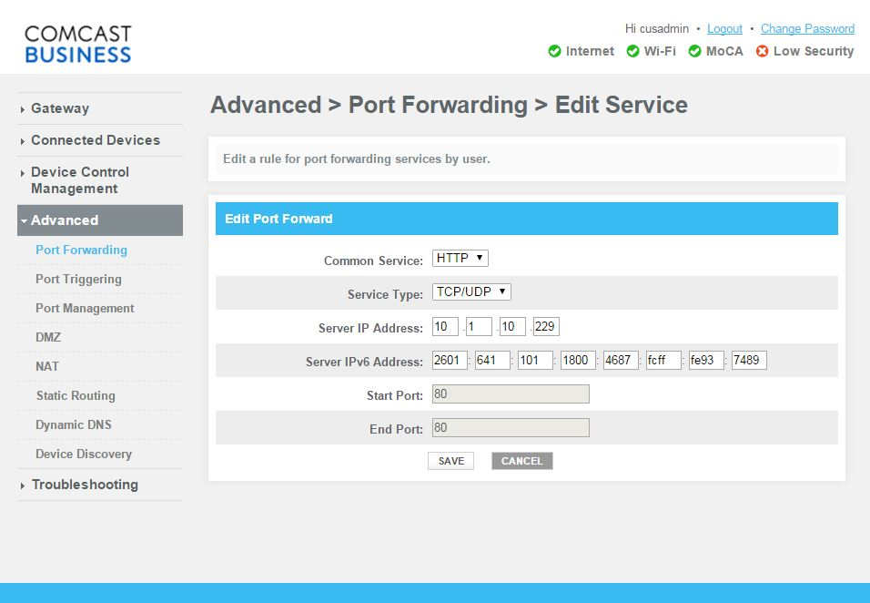

# port forwarding

In order to use the web server truly as a remote web server, we have to make it accessible outside the LAN. This can be achieved via port forwarding.

An excellent article can be found [here](http://www.howtogeek.com/66214/how-to-forward-ports-on-your-router/)

Suppose office ip address is `2601:641:101:1800:cc28:72aa:64:a454` 

The comcast business router default values are
http://10.1.10.1/
user: cusadmin
password: highspeed
